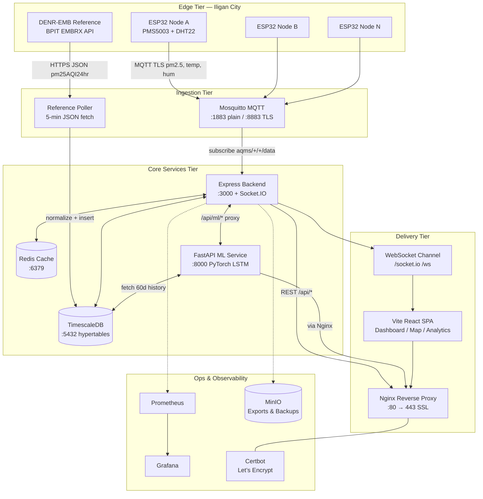
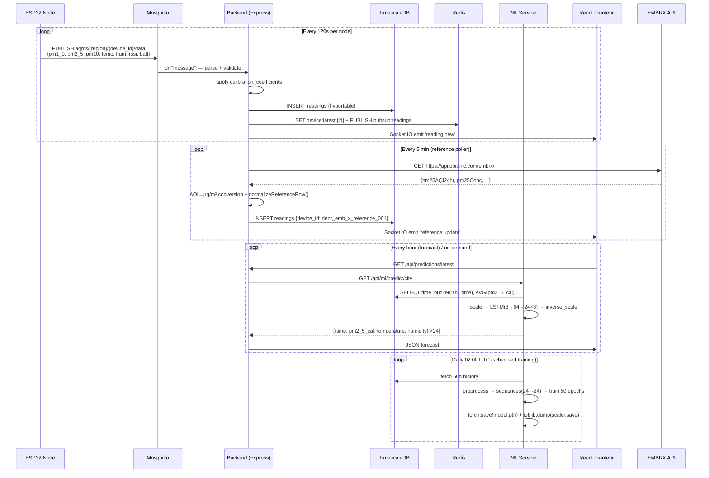
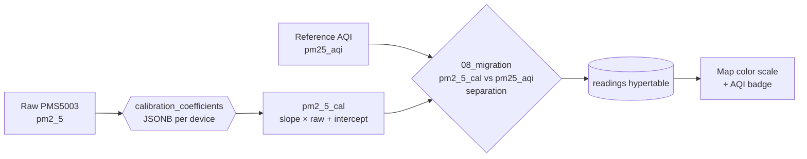
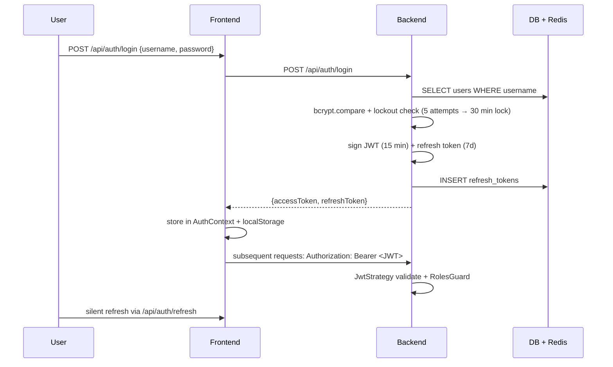
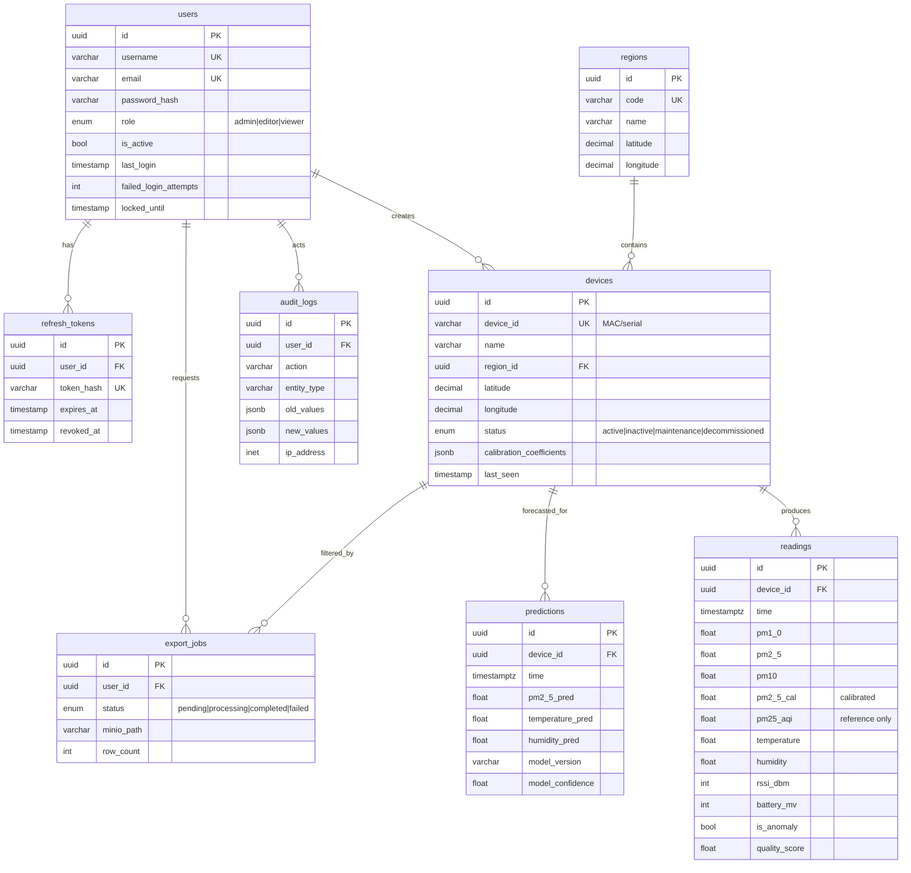
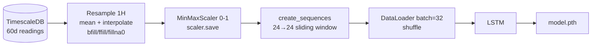

# Hyperlocal Air Quality Monitoring System (HY-AQMS)

<p align="center">
  <strong>Real-time, hyperlocal PM<sub>2.5</sub> monitoring with calibrated sensors, TimescaleDB, MQTT, and LSTM forecasting.</strong><br/>
  Built for Iligan City — scalable to any dense urban deployment.
</p>

<p align="center">
  
  
  
  
</p>

<p align="center">
  <a href="#-rationale-and-purpose">Rationale</a> •
  <a href="#-architecture-diagram">Architecture</a> •
  <a href="#-system-workflow">Workflow</a> •
  <a href="#-feature-list">Features</a> •
  <a href="#-api-documentation">API</a> •
  <a href="#-database-schema">Database</a> •
  <a href="#-ai-architecture">AI</a> •
  <a href="#-security-considerations">Security</a> •
  <a href="#-docker-setup">Docker</a> •
  <a href="#-cicd">CI/CD</a>
</p>

---

## Table of Contents

- [Rationale and Purpose](#-rationale-and-purpose)
- [Architecture Diagram](#-architecture-diagram)
- [System Workflow](#-system-workflow)
- [Feature List](#-feature-list)
- [API Documentation](#-api-documentation)
- [Database Schema](#-database-schema)
- [AI Architecture](#-ai-architecture)
- [Security Considerations](#-security-considerations)
- [Testing](#-testing)
- [Docker Setup](#-docker-setup)
- [CI/CD](#-cicd)
- [Screenshots](#-screenshots)
- [Demo](#-demo)
- [Project Structure](#-project-structure)
- [Getting Started](#-getting-started)
- [Environment Variables](#-environment-variables)
- [License & Acknowledgements](#-license--acknowledgements)

---

## 📖 Rationale and Purpose

### The Problem

Official air-quality stations (e.g., DENR-EMB) provide a **single reference point per city**. In a topographically complex city like **Iligan City, Philippines**, PM<sub>2.5</sub> varies dramatically street-by-street due to traffic corridors, industrial pockets, open burning, and micro-meteorology. A single AQI value misrepresents exposure for most residents.

Low-cost PMS5003-based sensors solve the density problem but introduce **calibration drift, inter-sensor variance, and environmental cross-sensitivity** (humidity/temperature). Raw values without reference alignment are misleading.

### The Solution — HY-AQMS

HY-AQMS is a **hyperlocal, calibrated, forecast-capable** air quality platform:

| Goal | How HY-AQMS delivers |
|------|----------------------|
| **Hyperlocal density** | Fleet of ESP32 + PMS5003 + DHT22 nodes reporting every 2 min over MQTT/TLS — one per barangay/cluster |
| **Trustworthy data** | Reference-node anchoring: a public DENR-EMB station (BPIT EMBRX JSON API → `pm25AQI24hr`) is polled every 5 min and used as calibration baseline (`pm2_5_cal` vs `pm25_aqi` separation) |
| **Real-time awareness** | MQTT ingestion → TimescaleDB hypertable → Redis hot-cache → Socket.IO broadcast → React dashboard with map, timeline, and alerts |
| **Foresight, not just hindsight** | LSTM (PyTorch) model trained on 60-day hourly aggregates forecasts **24 h** of PM<sub>2.5</sub>, temperature, and humidity per device and city-wide |
| **Operational resilience** | Dockerized microservices (Nginx, Express, FastAPI, TimescaleDB, Redis, Mosquitto) with automatic TLS renewal and 30-day backup retention |

### Primary Users

- **City Environment Office / DENR** — evidence for ordinances, hotspot identification
- **Researchers & students (MSU-IIT)** — open dataset, reproducible calibration pipeline
- **General public** — public dashboard (no login) + admin calibration panel
- **IoT maintainers** — device health, battery/RSSI, firmware OTA-ready scaffolding

### Design Principles

1. **Reference-anchored calibration** over blind low-cost aggregation.
2. **Time-series first** — TimescaleDB hypertables, not generic Postgres tables.
3. **Edge → Cloud with TLS everywhere** — device credentials never in plaintext.
4. **Progressive enhancement** — public read access; admin write with JWT + RBAC.
5. **Reproducible ops** — `docker compose up` is the only required command to run the full stack.

---

## 🏗 Architecture Diagram

### High-Level System Architecture



### Container Topology (docker-compose)

```
┌──────────────────────────────────────────────────────────────┐
│                     docker-compose.yml                        │
│  aqms-net (bridge)                                           │
│                                                              │
│  ┌──────────┐  ┌──────────┐  ┌───────┐  ┌──────────┐         │
│  │mosquitto │  │timescale │  │ redis │  │ ml-service│        │
│  │:1883/8883│  │ :5432    │  │ :6379 │  │  :8000   │         │
│  └────┬─────┘  └────┬─────┘  └───┬───┘  └────┬─────┘         │
│       │             │            │           │               │
│       └──────┬──────┴────────────┴─────┬─────┘               │
│              │  ┌─────────┐            │                     │
│              └──┤ backend │◄───────────┘                     │
│                 │  :3000  │                                  │
│                 └────┬────┘                                  │
│                      │                                       │
│                 ┌────▼────┐                                  │
│                 │frontend │  Nginx :80/:443                  │
│                 │  :80    │  /api/* → backend                │
│                 │         │  /api/ml/* → ml-service          │
│                 │         │  /socket.io → backend            │
│                 └─────────┘                                  │
└──────────────────────────────────────────────────────────────┘
```

### Request Routing (Nginx)

| Path | Upstream | Purpose |
|------|----------|---------|
| `/` | `frontend:80` (static SPA) | Dashboard, maps, docs |
| `/api/*` | `backend:3000` | Auth, devices, readings, stats, export |
| `/api/ml/*` | `ml-service:8000` | Predictions, training triggers |
| `/socket.io/*`, `/ws` | `backend:3000` | Real-time broadcast (Socket.IO) |
| `/.well-known/acme-challenge/*` | `certbot-www` | Let’s Encrypt HTTP-01 |

> Production adds automatic `http://$DOMAIN → https://$DOMAIN` redirect, HSTS, and certbot sidecar for 12-hour renewal.

---

## 🔄 System Workflow

### 1. End-to-End Data Flow



### 2. Calibration Workflow



- Per-device `calibration_coefficients` (`pm2_5_slope`, `pm2_5_intercept`, `temperature_offset`, `humidity_offset`) stored in `devices.calibration_coefficients` (JSONB).
- Migration `008_aqi_pm25_separation.sql` ensures reference rows never conflate AQI with µg/m³.
- Frontend `Calibration.jsx` allows admin to tune coefficients and preview effect.

### 3. Authentication & Session Flow



---

## ✨ Feature List

### Dashboard & Visualization

| Feature | Description | Component |
|---------|-------------|-----------|
| **Real-time Dashboard** | Live PM<sub>2.5</sub>, temperature, humidity cards with auto-refresh via Socket.IO | `Dashboard.jsx` |
| **Interactive Map** | Leaflet map with device markers, AQI color scale, popup latest readings, region filter | `MapView.jsx` |
| **Reference Timeline** | Dedicated strip for DENR-EMB reference node (AQI vs concentration toggle) | `ReferenceTimeline.jsx` |
| **Analytics & Charts** | Chart.js time-series, 24h/7d/30d aggregations, city vs device comparison | `Analytics.jsx` |
| **Data Flow Visual** | Animated node graph showing MQTT → Backend → DB → Frontend pipeline | `DataFlow.jsx` |
| **Weather Widget** | Ambient context alongside air-quality readings | `WeatherWidget.jsx` |
| **Responsive Layout** | Mobile-first CSS with `responsive.css`, collapsible panels | `responsive.css` |
| **Digital Clock & Loading** | Branded clock and splash screen for session transitions | `DigitalClock.jsx`, `LoadingScreen.jsx` |

### Device & Fleet Management

| Feature | Description |
|---------|-------------|
| **Device Registry** | CRUD for devices (`device_id`, name, region, lat/lng, model, firmware) — admin only |
| **Region Tagging** | Barangay/zone grouping (`Poblacion`, `Tibanga`, `Pala-o`, `Tambacan`, `Suarez`, `all`) with `RegionSelector.jsx` |
| **Status Tracking** | `active`/`inactive`/`maintenance` + `last_seen`, `battery_mv`, `rssi_dbm` |
| **Calibration Panel** | Per-device slope/intercept tuning with live preview | 
| **Simulation Injector** | Staggered test-data injection (10 sensors × 2 s stagger) for demos & load testing |

### Data & Forecasting

| Feature | Description |
|---------|-------------|
| **Reference Poller** | 5-min fetch from `https://api.bpit-inc.com/embrx/l` → AQI→µg/m³ conversion, `denr_emb_x_reference_001` |
| **City & Device Stats** | Aggregated endpoints `/api/stats/city` and `/api/stats/device/:id` (avg/max/min, 24 h window) |
| **24-Hour Forecasts** | City-wide and per-device LSTM predictions via `/api/ml/predict/*` |
| **CSV Export** | Admin-only async export (`/api/export?device_id=&start=&end=`) → MinIO signed URL |
| **Historical Query** | Flexible `time` range filtering with pagination on `/api/readings` |

### Platform & Ops

| Feature | Description |
|---------|-------------|
| **JWT Auth + RBAC** | `admin` / `editor` / `viewer` roles, bcrypt (cost 12), account lockout |
| **Rate Limiting** | Tiered: General 500/15 min, Readings 2000/15 min, Sim 10 000/15 min, Health unlimited |
| **MQTT TLS** | Dual listeners (1883 plain for lab, 8883 TLS for prod), Mosquitto ACL-ready |
| **Health Checks** | `GET /health` (backend) + Docker `HEALTHCHECK` on all services |
| **Docs Panel** | In-app `Docs.jsx` + `Pm25EnvironmentalAssessment.jsx` with Iligan-specific assessment |

---

## 📡 API Documentation

**Base URL:** `https://<DOMAIN>` (prod) or `http://localhost:3000` (dev) — all API routes prefixed `/api`.

**Auth:** `Authorization: Bearer <JWT>` unless marked `Public`.

### Authentication

| Method | Endpoint | Auth | Description |
|--------|----------|------|-------------|
| `POST` | `/api/auth/login` | Public | Login with `{username, password}` → `{accessToken, refreshToken}` |
| `POST` | `/api/auth/refresh` | Public | Refresh access token with `{refreshToken}` |
| `POST` | `/api/auth/register` | Public* | Register (dev). Prod restricts to admin. |

**Example — Login:**

```bash
curl -X POST http://localhost:3000/api/auth/login \
  -H "Content-Type: application/json" \
  -d '{"username":"admin","password":"hyperocalityaqmsthesis"}'
# → {"accessToken":"eyJ...","refreshToken":"rt-..."}
```

### Devices

| Method | Endpoint | Auth | Description |
|--------|----------|------|-------------|
| `GET` | `/api/devices` | Public | List all devices with region/status |
| `GET` | `/api/devices/:id/latest` | Public | Latest reading for one device |
| `POST` | `/api/devices` | JWT | Create device |
| `PUT` | `/api/devices/:id` | JWT | Full update |
| `PATCH` | `/api/devices/:id` | JWT | Partial update (calibration, status) |
| `DELETE` | `/api/devices/:id` | JWT | Soft/hard delete |

**Example — Create device:**

```bash
curl -X POST http://localhost:3000/api/devices \
  -H "Authorization: Bearer $TOKEN" \
  -H "Content-Type: application/json" \
  -d '{
    "device_id":"msu_iit_campus_001",
    "name":"MSU-IIT Campus",
    "latitude":8.228,
    "longitude":124.245,
    "region":"Tibanga",
    "calibration_coefficients":{"pm2_5_slope":1.0,"pm2_5_intercept":0.0}
  }'
```

### Readings

| Method | Endpoint | Auth | Query Params | Description |
|--------|----------|------|--------------|-------------|
| `GET` | `/api/readings` | Public | `device_id`, `start`, `end`, `limit`, `offset` | Time-range query |
| `GET` | `/api/readings/latest` | Public | `device_id`, `region` | Most recent N readings |
| `GET` | `/api/external/embrx/latest` | Public | — | Latest reference poll result |
| `POST` | `/api/sim/inject` | None (rate-limited) | — | Inject synthetic reading `{device_id, pm2_5, temperature, humidity}` |

**Example — Latest city readings:**

```bash
curl "http://localhost:3000/api/readings/latest?limit=10"
# → [{time, device_id, pm2_5, pm2_5_cal, pm25_aqi, temperature, humidity, rssi_dbm, ...}]
```

### Predictions

| Method | Endpoint | Auth | Description |
|--------|----------|------|-------------|
| `GET` | `/api/predictions` | Public | Historical predictions (DB-cached) |
| `GET` | `/api/predictions/latest` | Public | Most recent forecast set |
| `GET` | `/api/ml/predict/city` | Public | Live 24 h city forecast (proxied to ML service) |
| `GET` | `/api/ml/predict/device/:device_id` | Public | Live 24 h device forecast |
| `POST` | `/api/ml/train` | JWT (admin) | Trigger background retraining |

**Example — City forecast:**

```bash
curl http://localhost:3000/api/ml/predict/city
# → [{"time":"2026-09-21T01:00:00","pm2_5_cal":18.4,"temperature":29.1,"humidity":72}, ... ×24]
```

### Stats & Export

| Method | Endpoint | Auth | Description |
|--------|----------|------|-------------|
| `GET` | `/api/stats/city` | Public | 24 h city aggregates: avg/max/min PM<sub>2.5</sub>, temp, hum, device count |
| `GET` | `/api/stats/device/:id` | Public | Per-device aggregates |
| `GET` | `/api/export` | JWT (admin) | CSV export `?device_id=&start=&end=` → file download |
| `GET` | `/health` | Public | Liveness probe `{status:"ok", time}` |
| `GET` | `/api/sim/paused` | Public | Simulation pause state |
| `POST` | `/api/sim/pause` | Public | Toggle simulation pause |

### WebSocket (Socket.IO)

Connect to `http://localhost:3000` or `wss://<DOMAIN>`:

```javascript
import { io } from "socket.io-client";
const socket = io("http://localhost:3000");
socket.on("reading:new", (data) => console.log("new reading", data));
socket.on("reference:update", (data) => console.log("reference", data));
socket.on("prediction:new", (data) => console.log("forecast", data));
```

> **OpenAPI / Swagger:** Planned at `/api/docs` (see `ARCHITECTURE.md` – NestJS migration track). Current Express backend exposes self-documenting JSON via the table above.

---

## 🗄 Database Schema

**Engine:** TimescaleDB (PostgreSQL 16) with hypertables, `pgcrypto` for UUIDs, and idempotent migration runner (`schema_migrations`).

### Entity-Relationship Overview



### Key Tables (DDL Highlights)

#### `readings` — Hypertable (time-series)

```sql
CREATE TABLE readings (
  time        TIMESTAMPTZ NOT NULL,
  device_id   TEXT NOT NULL,
  pm1_0       FLOAT,
  pm2_5       FLOAT,
  pm10        FLOAT,
  pm2_5_cal   FLOAT,        -- calibrated, primary for charts
  pm25_aqi    FLOAT,        -- reference-node AQI (008 migration)
  temperature FLOAT,
  humidity    FLOAT,
  rssi_dbm    INT,
  battery_mv  INT
);
SELECT create_hypertable('readings', 'time', if_not_exists => TRUE);
CREATE INDEX ix_readings_device_time ON readings (device_id, time DESC);
-- + partitions, compression on older chunks (TimescaleDB)
```

#### `devices`

```sql
CREATE TYPE device_status AS ENUM ('active','inactive','maintenance','decommissioned');
CREATE TABLE devices (
  id              UUID PRIMARY KEY DEFAULT gen_random_uuid(),
  device_id       VARCHAR(255) UNIQUE NOT NULL, -- e.g. msu_iit_campus_001 or MAC
  name            VARCHAR(255) NOT NULL,
  region_id       UUID REFERENCES regions(id),
  latitude        DECIMAL(10,8) NOT NULL,
  longitude       DECIMAL(11,8) NOT NULL,
  status          device_status DEFAULT 'active',
  calibration_coefficients JSONB DEFAULT '{"pm2_5_slope":1.0,"pm2_5_intercept":0.0}',
  last_seen       TIMESTAMPTZ,
  battery_level   INT CHECK (battery_level BETWEEN 0 AND 100),
  created_by      UUID REFERENCES users(id)
);
```

#### `users` & `refresh_tokens`, `predictions`, `audit_logs`, `export_jobs`, `system_settings`

See `DATABASE_SCHEMA.md` and `backend/database/*.sql` (migrations `001`–`008`) for full DDL including constraints, partial indexes, triggers (`update_modified_column()`), and views (`latest_device_readings`, `regional_stats`).

### Migrations

```
backend/database/
├── 001_initial_schema.sql        # TimescaleDB extension + readings hypertable
├── 002_devices_table.sql
├── 003_users_table.sql
├── 004_add_region_to_devices.sql
├── 005_create_predictions_table.sql
├── 006_refresh_tokens_table.sql
├── 007_create_indexes.sql
└── 008_aqi_pm25_separation.sql   # pm25_aqi vs pm2_5_cal split
```

Migrations are **idempotent** and applied at backend startup via `runSqlMigrations()` → `schema_migrations` table, so `docker-entrypoint-initdb.d` one-shot limitation is bypassed.

### Performance Notes

- **Connection pooling:** `min:5, max:20, idleTimeout 30s` (PgBouncer-ready)
- **Compression:** TimescaleDB chunk compression for data older than 7 days
- **Retention:** Automated `DROP` of chunks older than 1 year (configurable via `system_settings`)
- **Redis hot-cache:** `device:latest:{id}` for O(1) latest-reading lookups

---

## 🤖 AI Architecture

### Overview

A **PyTorch LSTM** forecaster running as an isolated FastAPI microservice (`ml-service`). It is **not** in the request hot-path — the backend proxies to it, and the dashboard degrades gracefully to historical stats if the model is warming up.

### Model — `AQMSPredictor`

```
Input:  (batch, seq_len=24, features=3)   # pm2_5, temperature, humidity
           │
       LSTM(hidden=64, layers=2, dropout=0.2, batch_first=True)
           │  last hidden state (batch, 64)
       Linear(64 → pred_len × 3)   # 24 × 3 = 72
           │
Output: (batch, pred_len=24, features=3)  → inverse MinMaxScaler → clamp
```

| Hyperparameter | Value | Rationale |
|----------------|-------|-----------|
| `input_dim` | 3 | pm2_5, temp, hum |
| `hidden_dim` | 64 | Capacity vs ESP-scale data |
| `num_layers` | 2 | Depth without overfitting on 60-day windows |
| `seq_length` | 24 | One diurnal cycle (hourly buckets) |
| `pred_length` | 24 | Next-day forecast horizon |
| `dropout` | 0.2 | Regularization |
| `optimizer` | Adam, `lr=0.001` | Stable convergence |
| `loss` | MSE | Regression |
| `epochs` | 50 | Daily retrain budget |
| `batch_size` | 32 | Memory-efficient |

Source: `ml-service/model.py`, `ml-service/train.py`.

### Data Pipeline — `pipeline.py`



- **Resampling:** `df.resample('1H').mean().interpolate('linear').bfill().ffill().fillna(0)` — handles sparse node gaps.
- **Scaling:** `sklearn.preprocessing.MinMaxScaler` fitted once, persisted as `scaler.save`; reused for inference.
- **Sequences:** Overlapping windows `X[i: i+24] → y[i+24 : i+48]`.

### Training & Scheduling

| Trigger | When | What |
|---------|------|------|
| **Cold start** | `startup_event()` if `model.pth` missing | Schedule training +10 s (non-blocking) |
| **Cron** | Daily 02:00 UTC via `APScheduler` | `train_model(epochs=50)` on city-wide data |
| **On-demand** | `POST /api/ml/train` | Background task via `BackgroundTasks` |
| **Per-device** | `train_model(device_id=...)` | Optional fine-tune path (not auto-triggered) |

> Single Uvicorn worker (`--workers 1` in `docker-compose.prod.yml`) prevents parallel cold-start training races.

### Inference — `main.py`

```python
# Pseudocode of get_predictions(device_id, seq_length=24, pred_length=24)
raw = fetch_historical_data(device_id, days=60)  # time_bucket('1h', time)
df  = pd.DataFrame(raw).resample('1H').mean().interpolate(...)
scaler = joblib.load(SCALER_PATH)
X = torch.tensor(scaler.transform(df.tail(24)[features])).unsqueeze(0)
model = AQMSPredictor().load_state_dict(torch.load(MODEL_PATH))
pred_scaled = model(X)                      # (1, 24, 3)
pred_actual = scaler.inverse_transform(pred_scaled.squeeze(0))
# clamp: pm2_5 >=0, humidity 0-100 → return [{time, pm2_5_cal, temperature, humidity}×24]
```

**Endpoints:**

- `GET /api/ml/predict/city` — aggregates all devices (`AVG` per hour)
- `GET /api/ml/predict/device/{device_id}` — single-device history
- Returns `503` with `Model is currently training` if `model.pth`/`scaler.save` absent or history < 24 h.

### Limitations & Roadmap

- No exogenous features yet (wind, traffic) — planned.
- Single global model; per-region ensemble is a future enhancement (`ARCHITECTURE.md`).
- GPU acceleration auto-detected (`torch.cuda.is_available()`) but default is CPU.

---

## 🔒 Security Considerations

> Full hardening guide: [`SECURITY.md`](./SECURITY.md)

### Authentication & Authorization

| Control | Implementation |
|---------|----------------|
| **Password hashing** | `bcryptjs` cost 12, no plaintext storage |
| **JWT** | Access 15 min (`HS256`, `JWT_SECRET` ≥32 chars) + Refresh 7 d, single-use rotation, `refresh_tokens` table |
| **RBAC** | `admin` (all), `editor` (region-scoped write), `viewer` (read-only); `RolesGuard` on every mutating route |
| **Brute-force** | 5 failed logins → 30 min lockout (`lockedUntil`), per-IP rate limits on `/api/auth/login` (5/15 min) |
| **Password policy** | ≥12 chars, upper+lower+digit+special, not containing username |

### API & Transport Security

| Control | Implementation |
|---------|----------------|
| **Helmet** | CSP, HSTS (1 y, preload), `X-Frame-Options: DENY`, `X-Content-Type-Options: nosniff`, `Referrer-Policy: no-referrer` |
| **CORS** | Whitelist via `CORS_ORIGIN` env, credentials-aware |
| **CSRF** | `csurf` middleware (cookie-less, session-based) on state-changing routes |
| **Rate limiting** | Global 500/15 min; Readings 2000/15 min; Sim 10k/15 min; health unlimited |
| **Input validation** | `class-validator` DTOs, `ValidationPipe`, `Trim` + regex checks |
| **TLS** | Nginx 443 with Let’s Encrypt (prod) or self-signed fallback (dev); Mosquitto 8883 with `tlsv1.2` |

### Data & Secrets

| Control | Implementation |
|---------|----------------|
| **Sensitive masking** | `SensitiveDataInterceptor` strips `passwordHash`, masks emails for non-admin |
| **Audit logging** | `audit_logs` table (user, action, entity, old/new JSONB, IP, user-agent) + `AuditInterceptor` |
| **Secrets** | Env-only locally; Vault/AWS Secrets Manager in prod; no hardcoded creds; quarterly rotation via `scripts/rotate-secrets.sh` |
| **Env validation** | `Joi` schema in `configuration.ts` — fails fast on missing `JWT_SECRET`, weak `DB_PASSWORD`, etc. |
| **MQTT creds** | Per-device `device_{id}` users, `mosquitto_passwd` hashed, ACL file (`aqms/{region}/{device_id}/data`) |

### Infrastructure

| Control | Implementation |
|---------|----------------|
| **Non-root containers** | `nextjs`/`nestjs`/`mlservice` users (UID 1001), read-only root FS where feasible |
| **Network isolation** | Custom `aqms-net` bridge (172.20.0.0/16), no DB/Redis public exposure in prod |
| **Health probes** | Docker `HEALTHCHECK` + K8s readiness/liveness ready |
| **Backups** | Daily `pg_dump` → MinIO, 30-day retention, PITR via WAL |
| **Headers verification** | `curl -I https://api.example.com` should show `Strict-Transport-Security`, `Content-Security-Policy`, etc. |

### Incident Response (Summary)

1. **First hour:** revoke sessions, force password reset, enable enhanced logging.
2. **24 h:** review `audit_logs`, identify scope, collect forensics.
3. **Ongoing:** notify users/regulators, publish post-mortem, rotate all secrets.

---

## 🧪 Testing

### Current Coverage

| Layer | Framework | Command | Notes |
|-------|-----------|---------|-------|
| **Backend unit** | Jest (`auth.service.spec.ts`) | `npm --prefix backend test` | AuthService login/refresh/register |
| **Backend e2e** | Supertest (`auth.e2e-spec.ts`) | `npm --prefix backend run test:e2e` | Login flow, JWT guard |
| **Frontend** | ESLint + Vite build | `npm --prefix frontend run lint && npm run build` | Static analysis + prod bundle check |
| **ML service** | `pytest` + `flake8`/`black`/`isort` | `pytest ml-service/ --cov` | Pipeline + model shape tests |
| **Manual** | `scripts/deploy.sh` + `/health` | `curl http://localhost:3000/health` | Smoke after compose up |

### Running Tests Locally

```bash
# Backend
cd backend && npm ci && npm test
# Watch mode
npm run test:watch

# Frontend
cd frontend && npm ci && npm run lint

# ML service
cd ml-service && pip install -r requirements.txt pytest pytest-cov flake8 black isort
flake8 src/ --max-line-length=100
black --check src/
pytest -v --cov=src --cov-report=term
```

### CI Test Matrix (see CI/CD section)

- Node 20 for backend/frontend, Python 3.11 for ML, with Postgres 16 + Redis 7 services in GitLab CI.
- Coverage artifacts (Cobertura) and JUnit reports uploaded per job.

### Roadmap to Full Coverage

- **Target:** 80% line coverage on backend services (devices, readings, analytics).
- **Integration:** Testcontainers for TimescaleDB + Mosquitto; contract tests for `/api/ml/*`.
- **Load:** `k6` or `artillery` for MQTT ingestion (10k msg/min) and Socket.IO fan-out.

---

## 🐳 Docker Setup

### Prerequisites

- Docker Engine ≥ 24, Docker Compose v2, 4 GB RAM free, ports 80/443/3000/5432/6379/1883/8883 available.

### Quick Start (Development)

```bash
git clone https://github.com/aikanii/Hyperlocal-AQMS.git
cd Hyperlocal-AQMS
cp .env.example .env          # edit DOMAIN, passwords, REFERENCE_URL if needed
docker compose up --build -d
docker compose logs -f         # verify: backend, timescale, redis, mosquitto healthy
curl http://localhost:3000/health   # → {"status":"ok"}
# Frontend dev server (optional, for HMR):
cd frontend && npm ci && npm run dev  # → http://localhost:5173 (proxies /api to :3000)
```

### Production (with TLS)

```bash
# On your VPS with DNS A record → server IP for $DOMAIN
cp .env.example .env
# Set in .env: DOMAIN, EMAIL, POSTGRES_PASSWORD, JWT_SECRET (≥32 chars), MQTT_PASSWORD
chmod +x scripts/deploy.sh
./scripts/deploy.sh
# → builds prod stack, starts frontend for ACME challenge,
#   runs certbot webroot, then restarts with TLS + mosquitto certs
# Verify
curl -I https://$DOMAIN        # Strict-Transport-Security, etc.
mosquitto_pub -h $DOMAIN -p 8883 --cafile /etc/letsencrypt/live/$DOMAIN/fullchain.pem \
  -u mydevice -P $MQTT_PASSWORD -t "aqms/test/dev/data" -m '{"pm2_5":12}'
```

### Service Reference

| Service | Image / Build | Ports (dev) | Healthcheck |
|---------|---------------|-------------|-------------|
| `mosquitto` | `eclipse-mosquitto:2` | `1883`, `8883` | `mosquitto_sub -t $SYS/# -C 1` |
| `timescale` | `timescale/timescaledb:latest-pg16` | `5432` | `pg_isready` |
| `redis` | `redis:7-alpine` | `6379` | `redis-cli ping` |
| `backend` | `backend/Dockerfile` (node:20-alpine) | `3000` | `GET /health` |
| `ml-service` | `ml-service/Dockerfile` (python:3.11-slim) | `8000` | `GET /api/ml/health` |
| `frontend` | `frontend/Dockerfile` + `nginx.conf` | `80`, `443` | `GET /` |

### Useful Commands

```bash
docker compose ps
docker compose exec backend sh
docker compose exec timescale psql -U aqms_user -d aqms -c "SELECT * FROM readings ORDER BY time DESC LIMIT 5;"
docker compose exec redis redis-cli KEYS "device:latest:*"
docker compose down -v          # full reset (drops volumes)
docker compose -f docker-compose.prod.yml logs frontend --tail 100
```

### Multi-Stage Builds

All Dockerfiles use **multi-stage** optimization: builder → pruner → runtime with `dumb-init`, non-root user, and minimal Alpine/Slim base — ~70% smaller images vs single-stage.

See `DOCKER_GUIDE.md` and both `docker-compose.yml` / `docker-compose.prod.yml` for full specs, Traefik alternative, and MinIO/Prometheus/Grafana add-ons.

---

## ⚙️ CI/CD

> Full pipeline spec: [`CI_CD_PIPELINE.md`](./CI_CD_PIPELINE.md)

### Pipeline Overview (GitLab CI)

```
lint  ─┬─► lint:backend (node:20, npm run lint)
       ├─► lint:frontend (node:20)
       └─► lint:ml-service (flake8 + black + isort)

test  ─┬─► test:backend (postgres:16 + redis:7 services, jest --coverage)
       ├─► test:frontend (vitest --coverage)
       └─► test:ml-service (pytest --cov)

security ─┬─► dependency-check (Snyk, HIGH threshold)
          ├─► sast (bandit on ml-service)
          └─► container-scan (Trivy, SARIF)

build ─┬─► build:backend (docker build → tar.gz artifact)
       ├─► build:frontend
       └─► build:ml-service

push  ─┬─► push:backend (→ $REGISTRY_IMAGE-backend:$SHA + :stable/:dev tags)
       ├─► push:frontend
       └─► push:ml-service

deploy-staging  ─► manual on develop → Coolify → https://staging.hy-aqms.example.com
deploy-production ─► manual on main (needs build+test) → https://api.hy-aqms.example.com
rollback:production ─► manual emergency rollback
```

### Variables (GitLab → Settings → CI/CD → Variables, masked & protected)

```
CI_REGISTRY_USER / CI_REGISTRY_PASSWORD
COOLIFY_TOKEN / COOLIFY_API_URL
DB_PASSWORD / JWT_SECRET (≥32 chars)
MINIO_ACCESS_KEY / MINIO_SECRET_KEY
SLACK_WEBHOOK_URL (optional, for notify)
```

### Triggers

| Branch / Event | Stages Auto-Run | Manual |
|----------------|-----------------|--------|
| Merge Request | `lint` + `test` | — |
| `develop` push | `lint` + `test` + `build` + `push:dev` | `deploy:staging` |
| `main` push | all up to `push:stable` | `deploy:production`, `rollback` |
| Tag `v*.*.*` | `build` + `push` | — |

### Deployment Strategies

- **Blue-Green** via `scripts/deploy-blue-green.sh` (health-check gate before traffic switch).
- **Canary** (10% → 50% → 100%) via Coolify API with 5–10 min bake time.

### Caching & Performance

- `cache: key: files: [package-lock.json]` for `node_modules`.
- Parallel jobs per stage (GitLab auto-parallelizes same-stage jobs).
- Artifacts expire in 1 h (images) / 30 d (coverage) to control storage.

---

## 🖼 Screenshots

> Place captures under `docs/screenshots/` (git-ignored except this README reference). Suggested filenames below.

| Screenshot | Path | Description |
|------------|------|-------------|
| **Dashboard — Live Overview** | `docs/screenshots/dashboard.png` | Real-time PM<sub>2.5</sub> cards, AQI badges, auto-refresh indicator |
| **Map View — Hyperlocal Markers** | `docs/screenshots/mapview.png` | Leaflet map, clustered devices, color scale, region filter (`RegionSelector`) |
| **Analytics — Time Series** | `docs/screenshots/analytics.png` | Chart.js 24h/7d/30d toggles, city vs device overlay |
| **Reference Timeline** | `docs/screenshots/reference-timeline.png` | DENR-EMB AQI strip with µg/m³ conversion |
| **Devices & Calibration** | `docs/screenshots/devices-calibration.png` | Admin device table + per-device slope/intercept editor |
| **Data Flow Animation** | `docs/screenshots/dataflow.png` | Node graph: ESP32 → MQTT → Backend → DB → Frontend |
| **Mobile Responsive** | `docs/screenshots/mobile.png` | Collapsed panels on 375px viewport |
| **Login / RBAC** | `docs/screenshots/login.png` | Public view vs admin session (`AccessNotification`) |

To generate them:

```bash
docker compose up -d
# Seed a few readings
curl -X POST http://localhost:3000/api/sim/inject -H "Content-Type: application/json" \
  -d '{"device_id":"msu_iit_campus_001","pm2_5":24,"temperature":30,"humidity":68}'
# Open http://localhost and capture with your OS screenshot tool
```

If `docs/screenshots/` is empty, the dashboard still runs — these are documentation aids, not runtime assets.

---

## 🎬 Demo

### Live Demo (if deployed)

- **Dashboard:** `https://<DOMAIN>` (public, no login)
- **API health:** `https://<DOMAIN>/health`
- **City forecast:** `https://<DOMAIN>/api/ml/predict/city`

> Replace `<DOMAIN>` with your deployment domain. For local demo, use `http://localhost`.

### Local Demo Script (5 minutes)

```bash
# 1. Start stack
cp .env.example .env && docker compose up --build -d
sleep 15 && curl http://localhost:3000/health

# 2. Login as admin (default seeded: admin / hyperocalityaqmsthesis)
TOKEN=$(curl -s -X POST http://localhost:3000/api/auth/login \
  -H "Content-Type: application/json" \
  -d '{"username":"admin","password":"hyperocalityaqmsthesis"}' | jq -r .accessToken)

# 3. Register a device
curl -s -X POST http://localhost:3000/api/devices \
  -H "Authorization: Bearer $TOKEN" -H "Content-Type: application/json" \
  -d '{"device_id":"demo_node_001","name":"Demo Node","latitude":8.228,"longitude":124.245,"region":"Tibanga"}' | jq

# 4. Inject readings (staggered, as firmware would)
for i in 1 2 3; do
  curl -s -X POST http://localhost:3000/api/sim/inject \
    -H "Content-Type: application/json" \
    -d "{\"device_id\":\"demo_node_001\",\"pm2_5\":$((15 + i*5)),\"temperature\":$((28+i)),\"humidity\":$((65+i*2))}" | jq
  sleep 2
done

# 5. Query & forecast
curl -s "http://localhost:3000/api/readings/latest?device_id=demo_node_001" | jq
curl -s http://localhost:3000/api/stats/city | jq
curl -s http://localhost:3000/api/ml/predict/city | jq '.[0:3]'

# 6. Open dashboard
echo "Open http://localhost — you should see Demo Node on the map and in Analytics."
```

### Video Walkthrough (placeholder)

- **Loom / YouTube:** `https://your-demo-video.example.com` — 3-min walkthrough: cold start → device creation → live map update → forecast chart.
- To record: use the script above, then screen-capture the dashboard, `DataFlow`, and `Analytics` panels.

### Simulation Mode

For presentations without hardware, the frontend `Simulation.jsx` panel and backend `simLimiter` (10k/15 min) allow rapid injection of synthetic data. Toggle pause via `POST /api/sim/pause` and observe real-time Socket.IO updates.

---

## 📁 Project Structure

```
Hyperlocal-AQMS/
├── backend/                 # Express + Socket.IO + MQTT subscriber
│   ├── database/            # 001–008 SQL migrations (idempotent)
│   ├── index.js             # App entry, routes, rate limiters, poller
│   ├── auth.service.ts      # JWT + RBAC (NestJS migration track)
│   ├── app.module.ts / main.ts
│   ├── Dockerfile
│   └── package.json
├── frontend/                # Vite + React SPA
│   ├── src/
│   │   ├── components/      # Dashboard, MapView, Analytics, Devices, Calibration, DataFlow, Docs, …
│   │   ├── contexts/        # AuthContext, ReadingsContext
│   │   ├── utils/           # exportDataset, referenceNode
│   │   ├── App.jsx / main.jsx
│   │   └── App.css / index.css / responsive.css
│   ├── nginx.conf / nginx.prod.conf
│   ├── entrypoint.sh        # Cert generation + Nginx chaining
│   └── Dockerfile / vite.config.js
├── ml-service/              # FastAPI + PyTorch LSTM
│   ├── main.py              # /api/ml/predict/*, /api/ml/train
│   ├── model.py             # AQMSPredictor
│   ├── pipeline.py          # preprocess + create_sequences
│   ├── train.py             # train_model
│   ├── database.py          # fetch_historical_data
│   └── Dockerfile / requirements.txt
├── firmware/                # ESP32 (PlatformIO)
│   ├── src/main.cpp         # PMS5003 + DHT22 → MQTT/TLS
│   └── platformio.ini
├── mosquitto/
│   ├── mosquitto.conf       # 1883 + 8883 TLS
│   └── passwd               # mosquitto_passwd (git-ignored)
├── nginx/                   # alt Nginx configs
├── scripts/
│   ├── deploy.sh            # Prod one-click deploy + certbot
│   └── setup-nestjs.sh/.bat
├── docker-compose.yml       # Dev stack
├── docker-compose.prod.yml  # Prod stack (certbot, restart policies)
├── .env.example
├── ARCHITECTURE.md          # Deep architecture doc
├── DATABASE_SCHEMA.md       # Normalized schema spec
├── DOCKER_GUIDE.md          # Docker best-practices
├── SECURITY.md              # Hardening guide
└── CI_CD_PIPELINE.md        # GitLab CI spec
```

---

## 🚀 Getting Started

### Prerequisites

- Node.js 20+, Python 3.11+, Docker 24+ (for containerized run), Git.

### Option A — Docker (recommended)

```bash
git clone https://github.com/aikanii/Hyperlocal-AQMS.git
cd Hyperlocal-AQMS
cp .env.example .env
# Edit .env: set strong POSTGRES_PASSWORD, JWT_SECRET, MQTT_PASSWORD, DOMAIN
docker compose up --build -d
curl http://localhost:3000/health
# Frontend at http://localhost (Nginx) or http://localhost:5173 (Vite dev)
```

### Option B — Local without Docker

```bash
# TimescaleDB + Redis + Mosquitto must be running locally and match .env hosts
# Backend
cd backend && npm ci && npm start        # → http://localhost:3000
# Frontend
cd frontend && npm ci && npm run dev     # → http://localhost:5173
# ML service
cd ml-service && pip install -r requirements.txt && uvicorn main:app --reload --port 8000
```

### Default Admin

Seeded via migration / `index.js` bootstrap:

- **Username:** `admin`
- **Password:** `hyperocalityaqmsthesis` (change immediately in production via `PATCH /api/users` or DB)

---

## 🔧 Environment Variables

Key variables (see `.env.example` for full template):

| Variable | Default (dev) | Description |
|----------|---------------|-------------|
| `DOMAIN` | `localhost` | Public domain for Nginx + Let’s Encrypt |
| `EMAIL` | `admin@yourdomain.com` | Let’s Encrypt notification |
| `POSTGRES_DB` / `POSTGRES_USER` / `POSTGRES_PASSWORD` | `aqms` / `aqms_user` / `secret` | TimescaleDB creds — **change in prod** |
| `POSTGRES_HOST` | `timescale` | DB host (compose service name) |
| `REDIS_URL` | `redis://redis:6379` | Redis hot-cache |
| `MQTT_URL` / `MQTT_USERNAME` / `MQTT_PASSWORD` | `mqtt://mosquitto:1883` / `mydevice` / `mypassword` | MQTT — use `mqtts://` + strong password in prod |
| `JWT_SECRET` | `aqms_super_secret_key` | HS256 secret — **≥32 random chars in prod** |
| `REFERENCE_URL` | `https://api.bpit-inc.com/embrx/l` | EMBRX JSON API for reference node |

Generate strong secrets:

```bash
openssl rand -hex 32  # for JWT_SECRET
openssl rand -hex 16  # for DB/MQTT passwords
```

---

## 📄 License & Acknowledgements

- **License:** MIT (see `LICENSE` if present; otherwise treat as MIT for academic use).
- **Reference data:** DENR-EMB via BPIT EMBRX (`api.bpit-inc.com/embrx/l` and `app.bpit-inc.com/iliganstation` visualization).
- **Thesis context:** MSU-IIT — Hyperlocal AQMS for Iligan City.
- **Built with:** React, Vite, Leaflet, Chart.js, Express, Socket.IO, Mosquitto, TimescaleDB, Redis, FastAPI, PyTorch, Nginx, Docker, Let’s Encrypt.

---

<p align="center">
  <em>For deep dives, see <code>ARCHITECTURE.md</code>, <code>DATABASE_SCHEMA.md</code>, <code>SECURITY.md</code>, <code>DOCKER_GUIDE.md</code>, and <code>CI_CD_PIPELINE.md</code>.</em><br/>
  <strong>Questions?</strong> Open an issue or contact the maintainers via the dashboard Docs panel.
</p>
