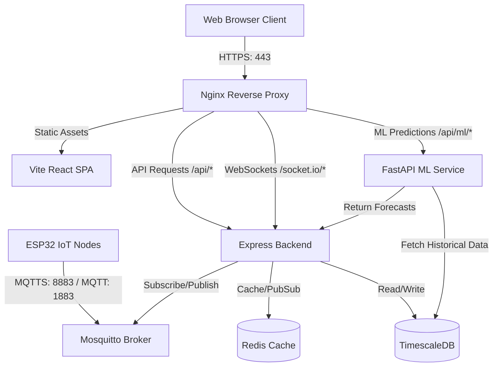

# HY-AQMS: System Architecture & File Structure

This document outlines the architecture, technology stack, and directory layout of the Hyperlocal Air Quality Monitoring System (HY-AQMS).

---

## 🏛️ System Architecture

HY-AQMS is built on a containerized microservices architecture. It handles real-time air quality data streaming, historical persistence, machine learning-based forecasting, and dynamic WebSocket broadcasts.



---

## 🛠️ Technology Stack & Frameworks

| Service | Technology / Framework | Role |
| :--- | :--- | :--- |
| **Frontend** | React (Vite) + Vanilla CSS | Real-time visual dashboard, maps, and admin configurations |
| **Backend** | Node.js + Express + Socket.IO | Handles authentication, API routing, database interface, and WebSockets |
| **ML Service** | Python + FastAPI + PyTorch/TensorFlow | Manages training pipelines and LSTM models for forecasting |
| **MQTT Broker** | Eclipse Mosquitto | Handles real-time telemetry ingestion from IoT sensor nodes |
| **Database** | TimescaleDB (PostgreSQL) | High-performance relational database optimized for time-series metrics |
| **Cache** | Redis | Speeds up sensor status checking and handles internal event caching |
| **Reverse Proxy** | Nginx | Terminates SSL/TLS, serves frontend bundle, and proxies APIs/WebSockets |

---

## 📁 Repository Directory Layout

Here is the structural mapping of the HY-AQMS codebase:

```text
HY-AQMS/
├── backend/                       # Node.js API & Gateway Service
│   ├── database/                  # SQL Schema migrations (001 to 005)
│   ├── Dockerfile                 # Multi-stage Docker build config
│   ├── index.js                   # Express application entrypoint
│   ├── package-lock.json          # Dependency lockfile
│   └── package.json               # Backend dependencies & scripts
│
├── frontend/                      # Vite + React User Interface
│   ├── public/                    # Static assets & SVG icon maps
│   ├── src/                       # React Application Source
│   │   ├── assets/                # Local styling images
│   │   ├── components/            # UI Panels (Analytics, MapView, Docs, etc.)
│   │   ├── contexts/              # Global application contexts (Auth)
│   │   ├── App.css / index.css    # Central styling system (Dark theme rules)
│   │   ├── config.js              # Environment settings & URL routing
│   │   └── main.jsx / App.jsx     # Frontend DOM entrypoints
│   ├── Dockerfile                 # Multi-stage frontend Docker builder
│   ├── entrypoint.sh              # Custom entrypoint for SSL generation & Nginx chaining
│   ├── nginx.conf                 # Production Nginx reverse-proxy template
│   └── package.json               # Frontend dependencies & configurations
│
├── ml-service/                    # Asynchronous LSTM Prediction Pipeline
│   ├── Dockerfile                 # FastAPI Docker configuration
│   ├── database.py                # Database connection utilities
│   ├── main.py                    # API controller endpoints
│   ├── model.py                   # PyTorch/TensorFlow LSTM model design
│   ├── pipeline.py                # Core forecasting run loop
│   ├── train.py                   # Model training and optimization script
│   └── requirements.txt           # Python library dependencies
│
├── mosquitto/                     # MQTT Ingestion Broker Config
│   ├── certs/                     # Active self-signed TLS certificates (Git ignored)
│   ├── data/ & log/               # Live database & audit logs (Git ignored)
│   ├── mosquitto.conf             # Local listener & certificate settings
│   └── passwd                     # Hashed user/device credentials
│
├── firmware/                      # IoT Node ESP32 C++ Codebase
│   ├── src/
│   │   └── main.cpp               # C++ code for telemetry collection & MQTT dispatch
│   └── platformio.ini             # PlatformIO build configurations
│
├── scripts/                       # Deployment and configuration automation scripts
│   └── deploy.sh                  # Automation script for pulling and restarting containers
│
├── docker-compose.yml             # Local environment compose configuration
├── docker-compose.prod.yml        # Production stack compose configuration (with SSL/Nginx)
├── .env.example                   # Shared template for environment variables
└── .gitignore                     # Root rule-list for untracked workspace files
```

---

## 🔍 Service Directory Breakdown

### 1. `backend/`
Contains the core Node.js server. The `database/` folder houses incremental SQL migrations that configure TimescaleDB hypertables, indexes, credentials, and forecasting schema. The `index.js` file manages:
* User registration and JWT-based authentication.
* Socket.IO connection handling for real-time dashboards.
* An MQTT listener that parses incoming PM1.0, PM2.5, PM10, temperature, and humidity payloads, inserting them into TimescaleDB.

### 2. `frontend/`
A single-page application built on Vite and React.
* **`nginx.conf`**: The gateway configuration that redirects HTTP to HTTPS and sets up reverse proxies for the API (`/api/`), the WebSocket framework (`/socket.io/`), and the Machine Learning service (`/api/ml/`).
* **`entrypoint.sh`**: Runs on startup to verify if Let's Encrypt certificates are present. If missing, it generates a fallback self-signed SSL certificate with Subject Alternative Names (SANs) for secure local browser testing.
* **`src/components/`**: Features separate panels, including `MapView` (interactive spatial maps), `Analytics` (historical charts), and `DataFlow` (visual system-nodes connectivity chart).

### 3. `ml-service/`
A standalone FastAPI microservice written in Python. It handles LSTM model processing for predicting future PM2.5 trends.
* **`pipeline.py`**: Reads time-series logs from TimescaleDB, processes them through the LSTM network defined in `model.py`, and publishes forecasts back to the database.

### 4. `mosquitto/`
Manages the Eclipse Mosquitto broker setup.
* **`mosquitto.conf`**: Sets up two listeners: Port `1883` for unencrypted local device testing, and Port `8883` for SSL-encrypted communication (using local or production certs).
* **`passwd`**: An authenticated user database generated with `mosquitto_passwd`.
